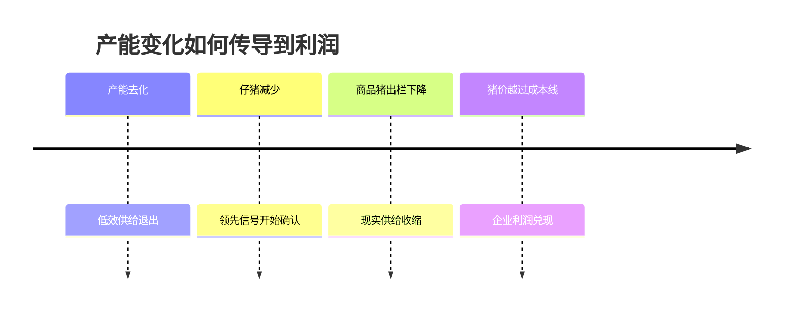

# Mermaid Editorial Guide

Use Mermaid only when a diagram makes a relationship materially faster to understand than prose. For a normal 1,500–3,000 Chinese-character article, prefer 2–4 diagrams. If more than one diagram is used, normally use at least two diagram families.

## Choose by Question

| Reader question | Recommended diagram | Avoid |
| --- | --- | --- |
| How does one variable cause another? | `flowchart` | Using it for a purely chronological list |
| When does a thesis transmit or mature? | `timeline` | Fake precision on dates that are only ranges |
| Where do securities sit on two dimensions? | `quadrantChart` | Coordinates presented as measured data |
| How do several qualitative attributes compare? | `radar-beta` | Scores without criteria or an “author framework” label |
| How does a measured value change over time or scenarios? | `xychart-beta` | Fabricated data or categorical judgments disguised as a series |
| What are the branches of a thesis or kill case? | `mindmap` | Deep nesting that becomes unreadable on mobile |
| What states can an event-driven security enter? | `stateDiagram-v2` | A simple causal chain better shown as a flowchart |
| How does a quantified amount move between stages? | `sankey-beta` | Any use without reconciled numeric flows |
| What proportion makes up a verified whole? | `pie` | Suggested portfolio weights or non-exhaustive categories |

## Composition Rules

- Give each diagram one question to answer and a nearby sentence stating the takeaway.
- Keep labels short, use Chinese reader-facing terms, and avoid paragraphs inside nodes.
- Treat titles and node labels as publication copy: proofread them and use the same terminology as the surrounding article.
- Design for a narrow mobile column. Prefer fewer than 10 visible nodes or data points unless the structure remains legible.
- Do not encode the same idea in both a flowchart and a timeline.
- One flowchart per article is normally enough. A second requires a genuinely different causal system.
- Label subjective charts in the title or surrounding prose, for example “作者的定性比较框架（非量化评级）”. Explain the dimensions and why each score exists.
- For `xychart-beta`, `pie`, and `sankey-beta`, cite or identify the data immediately before or after the diagram.
- Avoid decorative colors and raw HTML inside Mermaid definitions. The site controls light/dark theming.
- If Mermaid syntax is uncertain, prefer a simpler supported diagram over experimental syntax.

## Recommended Mix for a Cycle Article

Use this as a pattern, not a mandatory template:

1. `timeline` for the lag between capacity change and earnings realization.
2. One `flowchart` for the central causal mechanism.
3. `radar-beta` or `quadrantChart` for security expression, explicitly labeled subjective.
4. `mindmap` for disconfirmers and monitoring evidence.

Do not add a chart merely to reach this count.

## Example

Follow it with an interpretation such as: “这张图的重点不是预测精确月份，而是提醒我，股票、母猪数据和利润表处在不同的时钟上。”
